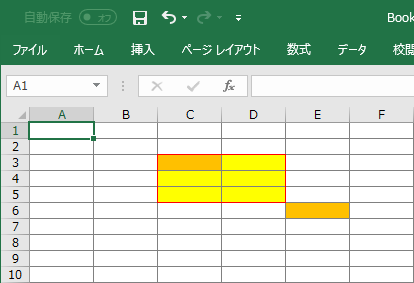

# open xml sdk

excel (spread sheet) の作成

[SpreadsheetML ドキュメントの構造 (Open XML SDK)](https://docs.microsoft.com/ja-jp/office/open-xml/structure-of-a-spreadsheetml-document)

[Open XML SDK P-SPACE 開発室 ブログ](https://www.p-space.jp/index.php/development/open-xml-sdk)

[Windows Azure ＆ ASP.NET MVC4 ＆ itextsharp で日本語PDFファイルの動的生成](http://normalian.hatenablog.com/entry/20120503/1336033214)

PDF の場合は、フォントのインストールが必須になるやもだが、Excelファイルであれば、フォントの定義だけでよいのではないだろうか。

[OfficeDev/Open-XML-SDK](https://github.com/OfficeDev/Open-XML-SDK)

Open XML SDK では、様々な 数値の id が出てくるが、それが何を表しているのかが非常に分かりにくい。

ECMA Open Office の定義書や、stackoverflow.com github 上の Open XML SDK や、Closed.XML などのソースを参考にした。

Closed.XML は Closed.XML 独自で定義している設定を使って Open XML SDK を ラップしている。

一番面倒なのが、各セルの書式設定だが、変に凝った罫線表現を行う場合、CellFormat の数が非常に膨大な数になる

Excel についても一定の理解が必要になる

数値や日付など、書式設定を行って対応できるものは 書式設定を行って対応すべきで、
文字列などにしてしまうとExcelの恩恵を受けられなくなる。

プログラムからの利用方法

```terminal
> install-package DocumentFormat.OpenXml
```

## spread sheet document の構成

```cs
using (var stream = new FileStream("temp.xlsx", FileMode.Create))
// document が Spreadsheet のファイル
using (var document = SpreadsheetDocument.Create(stream, SpreadsheetDocumentType.Workbook))
{
    // workbookPart は、excel のメタ情報などを定義したもの
    var workbookPart    = document.AddWorkbookPart();
    // worksheetPart は worksheet のメタ情報
    var worksheetPart   = workbookPart.AddNewPart<WorksheetPart>();
    // workbook は excel の具体的 データ情報
    var workbook        = (workbookPart.Workbook = new Workbook());
    // worksheet は worksheet の具体的データ情報
    var worksheet       = (worksheetPart.Worksheet = new Worksheet());
}
```

### spread sheet document 保存のタイミング

SpreadsheetDocument が Close されるとき

```cs
using (var stream = new FileStream("temp.xlsx", FileMode.Create))
using (var document = SpreadsheetDocument.Create(stream, SpreadsheetDocumentType.Workbook))
{
    var workbookPart    = document.AddWorkbookPart(); ...
}
```
上記のように `using` を二つ重ねて利用していたが、`MemoryStream` 上に Excelドキュメントを作成し、`byte[]` を取得しようとしたときにはまった。

```cs
using (var stream = new MemoryStream())
{
    using (var document = SpreadsheetDocument.Create(stream, SpreadsheetDocumentType.Workbook))
    {
        var workbookPart    = document....
    }
    return stream.ToArray();
}
```
手抜きをせずに、`using` をネストする必要があった。

### workbookPart で定義する情報

#### shared string table

Open XML では、文字列情報を SharedStringTable という辞書に保存し、cell の値などは、SharedStringTable の参照を記録する。

翻訳などで、具体的な cell の値を変更するのではなく、SharedStringTable の中身を変更することで、効率的に変更が行えるという狙いがあるそう。

Open XML SDKを利用し、cellに直接文字列を設定することも可能だが、Excelで開くと、同一の文字列は SharedStringTable へと自動的に変換する処理が走るため、何も編集していなくてもファイルを閉じる際に、変更の保存を確認するダイアログが表示されてしまう。

SharedStringTable へアクセスするには WorkbookPart -> SharedStringTablePart -> StardStringtTable とアクセスする必要がある


#### 印刷タイトルのタイトル行

[How to set Excel “Print Titles” with OpenXML](https://stackoverflow.com/questions/30238100/how-to-set-excel-print-titles-with-openxml)

WorkbookPart へ DefinedNames を追加

`_xlnm.Print_Titles` という `DefinedName` を追加する必要がある

構造化がなかなか難しく、WorkbookPart の DefinedName で定義せざるを得なかったのではないかと推測

LocalSheetId は 0ベーススタートとなる。

#### WorkbookStylesPart

book 全体で有効な スタイル一覧

普通に excel を起動し、空のファイルを保存しても styles.xml のサイズが非常に大きいものとなる

excel で ホームリボンの中にある スタイルをすべて保存している模様

[Minimal style sheet for Excel Open XML with dates?](https://stackoverflow.com/questions/26050708/minimal-style-sheet-for-excel-open-xml-with-dates)

Default font, Default fill, Default border, Default cell format の指定が必要とのこと。

FontFamilyNumbering の値は下記のようになる

ECMA Office Open XML 18.18.94 ST_FontFamily

https://docs.microsoft.com/en-us/dotnet/api/documentformat.openxml.spreadsheet.fontfamily?view=openxml-2.8.1

|Value|Font Family|remarks|
|----:|:----------|:------|
|    0|not applicable.|fonts of any style|
|    1|Roman|プロポーショナルフォントかつ serif|
|    2|Swiss|プロポーショナルフォントかつ sans-serif|
|    3|Modern|等幅フォント monospace|
|    4|Script|手書き風フォント|
|    5|Decorative|カリグラフィーなどの飾り文字|
|6..12|Reserved for future use|

serif :

    文字ストロークの端に飾りのある文字

sans-serif:

    文字飾りなし ゴシック体など

windows の graphic 関連の定義に紐づいている (Open Ofiice なのにWindows脳)


charset

Specifies the character set which is supported by the parent font. This information can be used in font substitution logic to locate an appropriate substitute font when this font is not available. This information is determined by querying the font when present and shall not be modified when the font is not available. 

ECMA Office Open XML 18.4.1 charset (Character Set) 

|INT Value|Character set|
|----:|:----------|
|0|ANSI_CHARSET|
|1|DEFAULT_CHARSET|
|2|SYMBOL_CHARSET|
|77|MAC_CHARSET|
|128|SHIFTJIS_CHARSET|
|129|HANGUL_CHARSET|
|130|JOHAB_CHARSET|
|134|GB2312_CHARSET|
|136|CHINESEBIG5_CHARSET|
|161|GREEK_CHARSET|
|162|TURKISH_CHARSET|
|163|VIETNAMESE_CHARSET|
|177|HEBREW_CHARSET|
|178|ARABIC_CHARSET|
|186|BALTIC_CHARSET|
|204|RUSSIAN_CHARSET|
|222|THAI_CHARSET|
|238|EASTEUROPE_CHARSET|
|255|OEM_CHARSET|

帳票では、MS 明朝を利用するので、Default Font には下記のように設定することになる...

```xml
<font>
    <sz val="9" />
    <name val="ＭＳ 明朝" />
    <family val="3" />
    <charset val="128" />
</font>
```

#### Stylesheet の定義

Stylesheet を定義する場合、下記の定義が必要になる

Fonts, Fills, Borders, CellStyleFormats

シートの定義済ではない 書式を設定する場合、 CellFormats に定義を行う。

#### CellFormat の定義

CellFormat で 定義する項目一覧

|property|mean|
|:-------|:---|
|NumberFormatId|書式設定 デフォルトの書式設定と、カスタム書式設定で別れる。詳細は、numFmt を参照|
|FormatId|何に利用しているのか要確認|
|FontId|フォントの設定|
|FillId|塗りつぶしの設定|
|BorderId|罫線の設定|
|Alignment|CellFormatの子要素 Vertical/Horizontal の設定を行う|

フォントが同一でも、罫線が異なる場合は、CellFormat を新しく定義する。

Cell へ CellFormat を設定するには、Cell.StyleId へ、CellFormats で定義した Id ( 0 ベース) を指定する。


### worksheet で定義する情報

worksheet に、具体的データの定義や、シート依存の情報 ページレイアウトや、列幅の指定などを行う

#### worksheet の 子情報の登録順

[OpenXml: Worksheet Child Elements change in ordering results in a corrupt file](https://stackoverflow.com/questions/11786891/openxml-worksheet-child-elements-change-in-ordering-results-in-a-corrupt-file)

element の 追加順序で Error が発生したりしなかったりする

CT_Worksheet に sequence があり、その順序に従う必要があるとのこと

DocumentFormat.OpenXml\GeneratedCode\schemas_openxmlformats_org_spreadsheetml_2006_main.g.cs

line 2824..2861 の下記の順に従う模様

```cs
SheetProperties
SheetDimension
SheetViews
SheetFormatProperties
Columns
SheetData
SheetCalculationProperties
SheetProtection
ProtectedRanges
Scenarios
AutoFilter
SortState
DataConsolidate
CustomSheetViews
MergeCells
PhoneticProperties
ConditionalFormatting
DataValidations
Hyperlinks
PrintOptions
PageMargins
PageSetup
HeaderFooter
RowBreaks
ColumnBreaks
CustomProperties
CellWatches
IgnoredErrors
Drawing
LegacyDrawing
LegacyDrawingHeaderFooter
DrawingHeaderFooter
Picture
OleObjects
Controls
WebPublishItems
TableParts
WorksheetExtensionList
```
#### Columns

Columns, Column を定義して、幅を設定可能

[C# OPENXML XLSX Custom Column width](https://stackoverflow.com/questions/38144487/c-sharp-openxml-xlsx-custom-column-width)

Columns は下記のプロパティを設定する

```cs
var columns = new Columns();
columns.Append(new[] {
    new Column { Min = 1, Max =  1, Width = 26.59, CustomWidth = true },
    new Column { Min = 2, Max =  2, Width =  5   , CustomWidth = true },
    new Column { Min = 3, Max = 11, Width = 12.14, CustomWidth = true },
});
worksheet.Append(columns);
```

備考：`OpenXmlElement.Append` メソッドは、`params OpenXmlElement[] newChildren` を引数にとるため、単純に `,` で連続して指定できるが、ソース管理上 項目を増減するたびに末尾の `,` を追加したり削除したりするのは あまりにも無意味。

そのため `new[] {}` で 配列とし、末尾は必ず `,` を付けるようにすると、項目追加や、削除時に 無駄なソースの変更が行われなくなる。


`Min`, `Max` は 1ベースの `ColumnIndex`

同一の設定を連続した複数カラムに行う場合、`Min`, `Max` を範囲で指定する

`Width (double)`, と `CustomWidth = true` を設定する

#### sheetdata

具体的な ワークシートの値を設定する

行 -> セル -> セルの値 という風にアクセスする。

SheetData の拡張メソッドを作成しておくと楽

```cs
/// 行を取得
public static Row GetRow(this SheetData data, uint rowIndex) {
    var row = data.Elements<Row>().FirstOrDefault(x => x.RowIndex == rowIndex);
    if (row == null) {
        row = new Row { RowIndex = rowIndex };
        data.AppendRow(row);
    }
    return row;
}
/// セルを取得
public static Cell GetCell(this SheetData data, uint rowIndex, string columnName) {
    var row = data.GetRow(rowIndex);
    // "A1", "C5" などの参照になる
    var cellReference = $"{columnName.ToUpper()}{rowIndex}";
    var cell = row.Elements<Cell>().GetFirstOrDefault(x => x.CellReference == cellReference);
    if (cell == null) {
        // row の中で、 A1, B1, とならばないといけないので、
        // 先に C1 などが登録されている場合は、その前に A1 を登録する
        // Z1 と AA1 との順序をうまく処理する必要があるので、 length のチェックを行っている
        var refCell = row.Elements<Cell>().FirstOrDefault(x
            => x.CellReference.Value.Length == cellReference.Length &&
            string.Compare(x.CellReference.Value, cellReference, true) > 0);
        cell = new Cell { CellReference = cellReference };
        row.InsertBefore(cell, refCell);
    }
    return cell;
}

/// セルにdecimal値を設定
public static void SetNumber(this SheetData data, uint rowIndex, string columnName, decimal value) {
    var cell = data.GetCell(rowIndex, columnName);
    cell.DataType = CellValues.Number;
    cell.CellValue = new CellValue(value.ToString());
}

/// セルにDateTime値を設定
public static void SetDate(this SheetData data, uint rowIndex, string columnName, DateTime date) {
    var cell = data.GetCell(rowIndex, columnName);
    // DateTime をToOADate で保存する場合、 DataType は特に指定しない
    cell.CellValue = new CellValue(date.ToOADate()
        .ToString(System.Globalization.CultureInfo.InvaliantCulter));
}
```

セルに値を設定する場合、 DataType および CellValue の設定が必要

DataType は CellValues の設定が必要 CellValuesで利用するのは Nuber, SharedString くらいのもの。

Date を設定する場合、事前に OADate へ変換しておく。

文字列の設定は SharedStringTable の設定が必要なため、事前に SharedStringTable を取得する拡張メソッドをいくつか用意しておく

```cs
/// SheetData から WorkSheet を取得
/// 事前に Worksheet へ SheetData を append しておく必要あり
public static Worksheet GetWorksheet(this SheetData data) => data.Parent as Worksheet;

/// worksheetpart から workbookpart の取得
/// worksheetpart の親は、基本的に workbookpart のみ
public static WorkbookPart GetWorkbookPart(this WorksheetPart part) => part.GetParentParts().First() as WorkbookPart;

/// sharedstringtablepart の取得
public static SharedStringTablePart GetSharedStringTablePart(this WorkbookPart bookPart) {
    var tablePart = bookPart.SharedStringTablePart;
    if (tablePart == null) {
        tablePart = bookPart.AddNewPart<SharedStringTablePart>();
    }
    return tablePart;
}

/// sharedstringtable の取得 なければ new
public static SharedStringTable GetShardStringTable(this SharedStringTablePart part) {
    if (part.SharedStringTable == null) {
        part.SharedStringTable = new SharedStringTable();
    }
    return part.ShardStringTable;
}

/// sharedstringtable の 文字列の index を取得
/// xml の Elements などを利用するので、テーブルが大きくなった場合に
/// もっと効率的に扱えるものへ変更するか検討が必要
public static int GetIndex(this SharedStringTablePart part, string value) {
    var table = part.GetSharedStringTable();
    var index = 0;
    foreach (var item in table.Elements<SharedStringItem>()) {
        if (item.InnerText == value) return index;
        index++;
    }
    table.Append(new SharedStringItem(new Text(value)));
    return index;
}

public static SetText(this SheetData data, uint rowIndex, string columnName, string value) {
    var worksheet = data.GetWorksheet();
    var bookPart  = worksheet.WorksheetPart.GetWorkbookPart();
    var tablePart = bookPart.GetSharedStringTablePart();

    var cell = data.GetCell(rowIndex, columnName);
    cell.DataType = CellValues.SharedString;
    cell.CellValue = new CellValue(tablePart.GetIndex(value).ToString());
}

```

#### SheetProtection

シートの保護を行う項目 パスワードは 謎のalgorithm でハッシュ化する必要がある

[SheetProtection Class](https://docs.microsoft.com/ja-jp/dotnet/api/documentformat.openxml.spreadsheet.sheetprotection?view=openxml-2.8.1)

sheet の保護を行う場合に利用する class

[Excel File Password Protection with Open XML SDK](https://stackoverflow.com/questions/15168011/excel-file-password-protection-with-open-xml-sdk/15281182#15281182)

[Password is not working for protected work sheet](https://social.msdn.microsoft.com/Forums/office/en-US/b166e244-d762-4bec-945a-918181ef80ef/password-is-not-working-for-protected-work-sheet?forum=oxmlsdk)


#### MergeCells

セルの結合情報

[Create Merge Cells using OpenXML](https://stackoverflow.com/questions/37182232/create-merge-cells-using-openxml)

`MergeCells` および `MergeCell` を利用することで、セルの結合を表現することが可能

```cs
var mergeCells = new MergeCells();
mergeCells.Append(new[] {
    new MergeCell { Reference = "A5:B6" },
    new MergeCell { Reference = "C5:C6" },
    new MergeCell { Reference = "D5:D6" },
});
```
`MergeCell` の順序はどのようなものでも構わないが、セルの範囲が重なるとエラーとなる。


#### PageSetup

ページレイアウト で設定する項目のうち ドキュメントの向きや、サイズなどを設定する

[PageSetup Class](https://docs.microsoft.com/ja-jp/dotnet/api/documentformat.openxml.spreadsheet.pagesetup?view=openxml-2.8.1)

Open XML で定義された PaperSize A4 は 9 

#### HeaderFooter

常に表示される　ヘッダー や、ページ情報などは `HeaderFooter` を利用する

[Using OpenXML to generate a spreadsheet and trying to get &\[Page\] of &\[Pages\] working in a custom footer](https://stackoverflow.com/questions/47421744/using-openxml-to-generate-a-spreadsheet-and-trying-to-get-page-of-pages-wo)

```cs
#region Static Properties
/// <summary>
/// The code for "current page #"
/// </summary>
public const string PageNumber = @"&P";
/// <summary>
/// The code for "total pages"
/// </summary>
public const string NumberOfPages = @"&N";
/// <summary>
/// The code for "text font color"
/// RGB Color is specified as RRGGBB
/// Theme Color is specified as TTSNN where TT is the theme color Id, S is either "+" or "-" of the tint/shade value, NN is the tint/shade value.
/// </summary>
public const string FontColor = @"&K";
/// <summary>
/// The code for "sheet tab name"
/// </summary>
public const string SheetName = @"&A";
/// <summary>
/// The code for "this workbook's file path"
/// </summary>
public const string FilePath = @"&Z";
/// <summary>
/// The code for "this workbook's file name"
/// </summary>
public const string FileName = @"&F";
/// <summary>
/// The code for "date"
/// </summary>
public const string CurrentDate = @"&D";
/// <summary>
/// The code for "time"
/// </summary>
public const string CurrentTime = @"&T";
/// <summary>
/// The code for "picture as background"
/// </summary>
public const string Image = @"&G";
/// <summary>
/// The code for "outline style"
/// </summary>
public const string OutlineStyle = @"&O";
/// <summary>
/// The code for "shadow style"
/// </summary>
public const string ShadowStyle = @"&H";
#endregion
```
エクセルの ヘッダーフッターでは、`&`が特殊文字となっているので、素の`&`を利用する場合、エスケープ処理が必要

下記のようなメソッドを作成した

```cs
private static string EscapeAmpersand(string value)
    => value.Replace("&", "&&");

// todo: 上述した特殊文字をヘッダー中に使いたい場合にどうするか
public static HeaderFooter GetHeaderFooter(
    string leftHeader   = null,
    string centerHeader = null,
    string rightHeader  = null) {
        var headerText = string.Concat(
            string.IsNullOrEmpty(leftHeader)   ? string.Empty : $"&L{EscapeAmpersand(leftHeader)}",
            string.IsNullOrEmpty(centerHeader) ? string.Empty : $"&C{EscapeAmpersand(centerHeader)}",
            string.IsNullOrEmpty(rightHeader)  ? string.Empty : $"&R{EscapeAmpersand(rightHeader)}"
        );
        return new HeaderFooter {
            OddHeader   = new OddHeader { Text = headerText },
            OddFooter   = new OddFooter { Text = "&C&P / &N ページ" },
            DifferenctOddEven = false,
        };
    }
)
```

HeaderFooter では、奇偶ページで 異なる ヘッダー・フッターを表示できたり、初回だけ異なるヘッダーを表示できたりする。

全ページ共通にするため、 DifferenctOddEven を false に設定する

#### RowBreaks

改ページの挿入

[OpenXML SDK - Setting excel page break to a certain number of columns](https://stackoverflow.com/questions/11381398/openxml-sdk-setting-excel-page-break-to-a-certain-number-of-columns)

`RowBreaks` を `Worksheet` へ挿入する

`RowBreaks` の 子要素は `Break`

`ColumnBreaks` の場合も `Break`

`RowBreaks` で `Break` を登録する場合、`Max` は 16838

`RowBreaks.Count` と `RowBreaks.ManualBreakCount` に値の設定が必要

`Break.Id` は、改ページを行う rowIndex

```cs
var indices = new[] { 20u, 30u, };
var rowBreaks = new RowBreaks();
rowBreaks.Append(indices.Select(x => new Break {
    Id              = x,
    Max             = 16383,
    ManualPageBreak = true,
}));
var count = (uint)indices.Length;
rowBreaks.Count             = count;
rowBreaks.ManualBreakCount  = count;
worksheet.Append(rowBreaks);
```


### CellFormat 

CellFormat や Border はいろいろと大変そうなので、まとめる

CellFormat の HorizontalAlignment は HorizontalAlignmentValues.CenterContinuous を連続して設定するとわざわざ Cell の結合を行わなくて済むため、ヘッダーなどでは積極採用することとする

[Cell styles in OpenXML spreadsheet (SpreadsheetML)](https://stackoverflow.com/questions/11116176/cell-styles-in-openxml-spreadsheet-spreadsheetml)

#### numFmt

Excelで定義されている 書式設定0..49

標準で定義されているもので、そのまま利用可能なものは、限りなく少ない。

円貨のみを取り扱う場合の、金額系の設定で 38 を利用するくらいか。

※外貨の場合、通貨コードにより小数点以下の有効桁数が変わってくる。

|ID|formatCode|
|-:|:---------|
|0|General|
|1|0|
|2|0.00|
|3|#,##0|
|4|#,##0.00|
|9|0%|
|10|0.00%|
|11|0.00E+00|
|12|# ?/?|
|13|# ??/??|
|14|mm-dd-yy|
|15|d-mmm-yy|
|16|d-mmm|
|17|mmm-yy|
|18|h:mm|AM/PM|
|19|h:mm:ss|AM/PM|
|20|h:mm|
|21|h:mm:ss|
|22|m/d/yy|h:mm|
|37|#,##0 ;(#,##0)|
|38|#,##0 ;\[Red\](#,##0)|
|39|#,##0.00;(#,##0.00)|
|40|#,##0.00;\[Red\](#,##0.00)|
|45|mm:ss|
|46|\[h\]:mm:ss|
|47|mmss.0|
|48|##0.0E+0|
|49|@|

カスタム定義 を行う場合は、StyleSheet に NumberingFormats NumberingFormat を追加する

なお NumberFormatId は 163 までは built-in で定義されているため、 164 以降を利用する

主に、年月日 yyyy/MM/dd の定義や、外貨利用時の小数点以下桁数を定義する場合に利用する。 円貨の金額の場合は、基本的に NumberFormatId 38 を利用する

## 画像の取り扱い

[Insert a picture into a word processing document (Open XML SDK)](https://docs.microsoft.com/en-us/office/open-xml/how-to-insert-a-picture-into-a-word-processing-document)

[C# & OpenXML: Insert an image into an excel document](https://stackoverflow.com/questions/5793950/c-sharp-openxml-insert-an-image-into-an-excel-document)

### 帳票で利用する画像の目的

請求書の 会社ロゴや、会社印鑑 を表示するのに利用する

主に印刷用途 (dpi等もそれに従ったものに)

### 画像利用の大まかな手順

WorksheetPart へ DrawingsPart を追加

追加した DrawingsPart へ ImagePart を追加

この際に、ImagePartType の指定が必要

ImagePart の FeedData(Stream source) メソッドを実行して、画像データを格納

WorksheetDrawing を 生成

WorksheetDrawing には、Anchor (3種類 AbsoluteAnchor / OneCellAnchor / TwoCellAnchor ) を複数定義できる

Anchor が画像の実質の定義であるため、後述

WorksheetDrawing に DrawingsPart を指定して Save

#### Worksheet とのつながり

上記の WorksheetPart, DrawingsPart, ImagePart, WorksheetDarwing はそれぞれ Worksheet とのつながりが存在していない。

Worksheet との紐づけを行うために、 Drawing を作成し、 Id を WorksheetPart の DrawingsPart から取得して設定

Worksheet に Drawing を Append して 画像の定義との紐づけが行う

なお、Anchor で、シートのどの位置に画像を配置するかを細かく指定する


### 画像の保存場所

./xl/media

### 画像 パスの保存場所

./xl/drawings/_rels/drawing1.xml.rels

```xml
..
<Relationship Id="rId1" Type="http://schemas.openxmlformats.org/officeDocument/2006/relationships/image" Target="../media/image1.jpg">
..
```
上記 `rId1` が画像のID

`rId1` が指定されている場所

./xl/drawings/drawing1.xml

```xml
...
<a:blip xmlns:r="http://schemas.openxmlformats.org/officeDocument/2006/relationships" r:embed="rId1">
...
```

drawing で定義されている xml タグの内容を把握する必要がある


worksheet からの逆引き

./xl/worksheets/sheet1.xml

drawing で定義されている

`<drawing r:id="rId2">`

drawing で定義されているIDは

./xl/worksheets/_rels/sheet1.xml.rels

`<Relationship Id="rId2" Type="http://../relationships/drawing" Target="../drawings/drawing1.xml"/>`

#### WorksheetDrawing の 構造

wsDr -> WorksheetDrawing の略

2つの namespace を定義

`xmlns:xdr="http://schemas.openxmlformats.org/drawingml/2006/spreadsheetDrawing"`

`xmlns:a="http://schemas.openxmlformats.org/drawingml/2006/main"`

WorksheetDrawing には、複数の xdr を所持できる

Open XML SDK では、TwoCellAnchor や OneCellAnchor などで、オブジェクトの位置を指定できる項目を複数指定できる。

WorksheetDrawing 自体は relationship を利用して、Worksheet と紐づけを行う

Worksheet で定義可能な Drawing は、上記 relationship で定義された rId を指定するのみ。

それぞれの *Anchor では、セル位置や、具体的な描画内容を定義する。テキストボックスや、画像などは *Anchor の中で定義する。

Anchor は、3つの指定方法がある

*   AbsoluteAnchor

    セルとの紐づけがなく、左上を絶対座標とした指定方法

*   OneCellAnchor

    指定した セルに紐づくが、サイズは固定

*   TwoCellAnchor

    指定した２つのセルに紐づく サイズはセルと連動

それぞれの子要素を列挙

TwoCellAnchor は RowHeight や、 Column Width を検討する必要があるので、指定がなかなか難しい

FromMarker / ToMarker で 指定する ColumnId, RowId の関係は下図の通り

"C3" から "E6" と指定すると、赤枠で囲ったセルの範囲が対象となる。



上記の範囲から FromMarker / ToMarker の (Column|Row)Offset に English Metric Units で値を指定することで 範囲を変更することが可能

画像の位置を簡単に指定するには、OneCellAnchor で配置した方がよい。

なお、画像描画領域と、実際の画像サイズが異なる場合は、ピクセル単位で、どのように表示するかを指定する必要がある

OneCellAnchor でも セルの左上からずらしたい場合は ピクセル単位で、(Column|Row)Offset の値を設定する

*   OneCellAnchor

    *   FromMarker

        使用 Column/Row ともに 0 から始まるindex を指定する セルの左上から位置がずれる場合は、Offset を設定する

    *   <font color="Gray">Extent 未使用</font>

    *   <font color="Gray">Shape 未使用</font>

    *   <font color="Gray">GroupShape 未使用</font>

    *   <font color="Gray">GraphicFrame 未使用</font>

    *   <font color="Gray">ConnectionShape 未使用</font>

    *   Picture

        使用 具体的なイメージの保存先

        *   NonVisualPictureProperties

            *   NonVisualDrawingProperties

                picture の id, name を登録する

            *   NonVisualPictureDrawingProperties

                [PictureLocks](https://docs.microsoft.com/ja-jp/previous-versions/office/cc865346(v=office.14)) を登録する

        *   BlipFill

            *   Blip

                画像の relation id と、namespace の定義が必要 ClosedXML では、CompressionState を Print に設定している 標準が Email になっているのだろうか

                [{BEBA8EAE-BF5A-486c-A8C5-ECC9F3942E4B}とは？](https://docs.microsoft.com/en-us/openspecs/office_standards/ms-odrawxml/f10da8b6-40f3-4527-9c3d-9f5c2e9cff45) 2010 以降で追加された画像の効果にアクセスするための値っぽい

                [{28A0092B-C50C-407E-A947-70E740481C1C}とは？](https://stackoverflow.com/questions/33521914/value-of-blipextension-schema-uri-28a0092b-c50c-407e-a947-70e740481c1c) -> useLocalDpi を利用するための値っぽい

            *   SourceRectangle

                OneCellAnchor の場合に利用

            *   <font color="Gray">Tile 未使用 タイル効果を利用する場合</font>

            *   Stretch

                拡大する場合に利用 子要素に FillRectangle を定義する

        *   ShapeProperties

        *   ShapeStyle

    *   <font color="Gray">ContentPart

        未使用  Office 2010 以降で利用される 画像の効果関連のプロパティを保存する</font>

    *   ClientData

        使用 シート保護されている場合に、選択できないようにしたり、印刷時に映さないようにするための属性を持つ

*   TowCellAnchor
    *   FromMarker
    *   ToMarker
    *   Shape
    *   GroupShape
    *   GraphicFrame
    *   ConnectionShape
    *   Picture
    *   ContentPart
    *   ClientData

実際の描画系コード

```cs
    public void Process(SpreadsheetDocument document) {
            ...
            // ここのId は Drawing で設定するID と同じにする
            var drawingsPart        = worksheetPart.AddNewPart<DrawingsPart>("rId1");
            ImagePart imagePart;

            // stream から bitmap 作成
            // db から取得する場合は byte[] から MemoryStream に流し込み
            Drw.Bitmap bitmap;
            using (var stream = new FileStream(ImagePath, FileMode.Open))
            {
                bitmap = new Drw.Bitmap(stream);
                // ここのid は EmbedId と共通 Image 毎に increment するようにする
                imagePart = drawingsPart.AddImagePart(bitmap.GetImagePartType(), "rId1");

                stream.Seek(0, SeekOrigin.Begin);
                imagePart.FeedData(stream);
            }
            var extentCx = bitmap.GetWidthEMU();
            var extentCy = bitmap.GetHeightEMU();
            // 同一画像を張り付ける場合は、 EmbedId が同じ Anchor を複数用意する
            // 画像自体が異なるものを 貼り付けたい場合、ImagePart を複数用意し、
            // それぞれのAnchor に別々の EbmedId を指定する
            var picture = new Picture {
                From            = new Marker("C2"),
                ExtentCx        = extentCx,
                ExtentCy        = extentCy,
                PropertyId      = 1,
                PropertyName    = "picture1",
                EmbedId         = drawingsPart.GetIdOfPart(imagePart),
            };

            var picture2 = new Picture {
                From            = new Marker("F5"),
                ExtentCx        = extentCx,
                ExtentCy        = extentCy,
                PropertyId      = 2,
                PropertyName    = "picture2",
                EmbedId         = drawingsPart.GetIdOfPart(imagePart),
            };


            var worksheetDrawing    = drawingsPart.WorksheetDrawing = new Xdr.WorksheetDrawing();
            worksheetDrawing.AddNamespaceDeclaration("a", "http://schemas.openxmlformats.org/drawingml/2006/main");
            worksheetDrawing.AddNamespaceDeclaration("r", "http://schemas.openxmlformats.org/officeDocument/2006/relationships");
            worksheetDrawing.Append(
                picture.GetAnchor(),
                picture2.GetAnchor());


            var drawing             = new Drawing { Id = worksheetPart.GetIdOfPart(drawingsPart) };
            worksheet.Append(drawing);
    }

```


その他 画像系の class などの情報

[`System.Drawing.Imaging.ImageFormat.cs`](https://github.com/dotnet/corefx/blob/master/src/System.Drawing.Common/src/System/Drawing/Imaging/ImageFormat.cs)

ImageFormat は 内部に guid を所持しており、ImageFormat.Guid でファイルの書式を判別可能

ECMA Office Open XML では pcx 形式の画像も対象としているが、C# nativeでは、pcx の画像取り扱いが行えない。当然 `System.Drawing.Imaing.ImageFormat` にも、Pcx は存在しない。pcx 形式の画像自体が死滅しているので、特段問題はないが...

```cs
System.Drawing.Bitmap bitmap;
Console.WriteLine(bitmap.RawFormat.Guid);
Console.WriteLine(System.Drawing.Imaging.Imageformat.Bmp.Guid);
```

MimeType は ImageCodecInfo.GetImageDecoders から 取得可能

stream -> relation id を取得するのに必要

bitmap -> 画像のサイズなどのメタ情報取得に必要

手順的には、binary で保存してある画像情報を取得

bitmap に展開して、RawFormat, サイズ情報を取得

取得したメタ情報と、画像を配置する アドレス情報を 連携し、Drawing の情報を登録する


----

## SpreadsheetDocument の 構成

1.  SpreadsheetDocument

    SpreadsheetDocumentType がある

    Workbook, Template, MacroEnabledWorkbook, MacroEnabledTemplate, AddIn の 5種類がある

    通常は Workbook

1.  WorkbookPart

    Workbook の メタ定義？

    book 全体で共有のスタイルや、SharedStringTablePart などにアクセス可能

    Workbook へアクセス可

1.  Workbook

    Workbook 本体

    WorkbookProtection を設定すると book の保護なども行える

    book の保護では、 シート構成 ウィンドウの保護が行える

    読み取り専用を解除するパスワードを設定するには sheet の保護を行う

1.  WorksheetPart

1.  Worksheet

1.  SheetData

1.  Sheets

1.  Sheet
